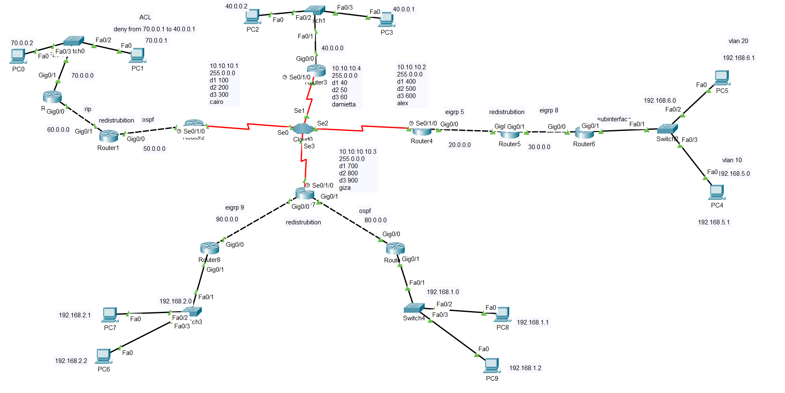

# 🌐 Enterprise WAN — Frame Relay & Multi-Protocol Routing


---

## 📌 Overview

This project simulates a **real-world enterprise WAN** connecting four company branches across Egypt using **Frame Relay** as the WAN technology. Each branch runs a different routing protocol based on its legacy infrastructure. Full connectivity is achieved through **Route Redistribution**, and traffic is controlled using **ACLs**.

> Full scenario: [docs/scenario.md](docs/scenario.md)

---

## 🏢 Branch Summary

| Branch | WAN Role | Internal Protocol | WAN IP | Key Subnet |
|--------|----------|-------------------|--------|------------|
| Cairo (HQ) | Hub | RIP + OSPF | 10.10.10.1/24 | 70.0.0.0/24, 60.0.0.0/24 |
| Damietta | Spoke | OSPF | 10.10.10.4/24 | 40.0.0.0/24 |
| Alexandria | Spoke | EIGRP AS5 + AS8 | 10.10.10.2/24 | 192.168.5.0/24, 192.168.6.0/24 |
| Giza | Spoke | OSPF + EIGRP AS9 | 10.10.10.3/24 | 192.168.1.0/24, 192.168.2.0/24 |

> Full IP addressing plan: [docs/ip-plan.md](docs/ip-plan.md)

---

## 🖼️ Network Topology



---

## 🎯 Project Requirements

### WAN
- [x] Connect all 4 branches via **Frame Relay ISP Cloud**
- [x] Configure **Hub-and-Spoke** — Cairo as the Hub
- [x] Assign DLCI values and verify PVCs (Permanent Virtual Circuits)

### Routing & Redistribution
- [x] **RIP v2** — Cairo internal LAN (60.0.0.0 / 70.0.0.0)
- [x] **OSPF** — Cairo edge ↔ Damietta ↔ Giza (WAN backbone)
- [x] **EIGRP AS8** — Alexandria internal LAN
- [x] **EIGRP AS5** — Alexandria edge toward WAN
- [x] **EIGRP AS9** — Giza internal LAN
- [x] **Route Redistribution** — RIP↔OSPF (Cairo), EIGRP↔EIGRP (Alex), OSPF↔EIGRP (Giza)

### VLANs — Alexandria Branch
- [x] **VLAN 10** → 192.168.5.0/24 (PC4)
- [x] **VLAN 20** → 192.168.6.0/24 (PC5)
- [x] **Router-on-a-Stick** on Alex Router (subinterfaces Gi0/1.10 & Gi0/1.20)
- [x] **Trunk port** configured on Switch2

### Security
- [x] **ACL 100** on Cairo Router — deny PC0 (70.0.0.1) → PC3 (40.0.0.1), permit all else

---

## 🛠️ Technologies Used

| Category | Details |
|----------|---------|
| WAN | Frame Relay, Hub-and-Spoke, DLCI, PVC |
| Routing Protocols | RIP v2, OSPF (Area 0), EIGRP (AS 5, 8, 9) |
| Advanced Routing | Route Redistribution across all protocol boundaries |
| LAN Segmentation | VLANs (802.1Q), Trunk Links |
| Inter-VLAN Routing | Router-on-a-Stick (subinterfaces) |
| Security | Extended ACL (traffic filtering) |
| Layer 2 Security | Port Security, BPDU Guard, PortFast, RSTP |
| Simulation Tool | Cisco Packet Tracer |

---

## 🔗 Key Configurations

<details>
<summary>📁 Frame Relay — Cairo Hub (edge-router-cairo.txt)</summary>

```bash
int s0/1/0
encapsulation frame-relay
ip add 10.10.10.1 255.255.255.0
frame-relay map ip 10.10.10.2 102 broadcast
frame-relay map ip 10.10.10.3 103 broadcast
frame-relay map ip 10.10.10.4 104 broadcast
no sh
```
Full config: [configs/cairo/edge-router-cairo.txt](configs/cairo/edge-router-cairo.txt)
</details>

<details>
<summary>📁 Route Redistribution — Cairo (redistrubition-router-cairo.txt)</summary>

```bash
router rip
redistribute ospf 22 metric 1

router ospf 22
redistribute rip subnets
```
Full config: [configs/cairo/redistrubition-router-cairo.txt](configs/cairo/redistrubition-router-cairo.txt)
</details>

<details>
<summary>📁 Route Redistribution — Alexandria (redistrubition-router-alex.txt)</summary>

```bash
router eigrp 5
redistribute eigrp 8 metric 10000 100 255 1 1500

router eigrp 8
redistribute eigrp 5 metric 10000 100 255 1 1500
```
Full config: [configs/alexandria/redistrubition-router-alex.txt](configs/alexandria/redistrubition-router-alex.txt)
</details>

<details>
<summary>📁 VLANs — Router-on-a-Stick (alex-router.txt)</summary>

```bash
int g0/1.10
encapsulation dot1Q 10
ip add 192.168.5.2 255.255.255.0

int g0/1.20
encapsulation dot1Q 20
ip add 192.168.6.2 255.255.255.0
```
Full config: [configs/alexandria/alex-router.txt](configs/alexandria/alex-router.txt)
</details>

<details>
<summary>📁 ACL — Block PC0 → PC3 (cairo-router.txt)</summary>

```bash
access-list 100 deny ip host 70.0.0.1 host 40.0.0.1
access-list 100 permit ip any any
```
Full config: [configs/cairo/cairo-router.txt](configs/cairo/cairo-router.txt)
</details>

---

## 📸 Verification Screenshots

### Frame Relay Maps
| Branch | Screenshot |
|--------|-----------|
| Cairo | [frame-relay-map-in-cairo.png](screenshots/frame-relay/frame-relay-map-in-cairo.png) |
| Alexandria | [frame-relay-map-in-alex.png](screenshots/frame-relay/frame-relay-map-in-alex.png) |
| Damietta | [frame-relay-map-in-damietta.png](screenshots/frame-relay/frame-relay-map-in-damietta.png) |
| Giza | [frame-relay-map-in-giza.png](screenshots/frame-relay/frame-relay-map-in-giza.png) |

### Redistribution
| Location | Screenshot |
|----------|-----------|
| RIP ↔ OSPF (Cairo) | [redistribution-rip-ospf-in-cairo.png](screenshots/redistribution/redistribution-rip-ospf-in-cairo.png) |
| EIGRP ↔ EIGRP (Alex) | [redistribution-eigrp-eigrp-in-alex.png](screenshots/redistribution/redistribution-eigrp-eigrp-in-alex.png) |
| EIGRP ↔ OSPF (Giza) | [redistribution-eigrp-ospf-in-giza.png](screenshots/redistribution/redistribution-eigrp-ospf-in-giza.png) |

### Connectivity & Security
| Test | Screenshot |
|------|-----------|
| Ping Success (cross-branch) | [ping-success.png](screenshots/ping/ping-success.png) |
| Ping Blocked (ACL) | [ping-blocked.png](screenshots/ping/ping-blocked.png) |
| ACL Config in Cairo | [acl-in-cairo.png](screenshots/acl/acl-in-cairo.png) |
| VLAN Router-on-a-Stick | [vlan-router-on-stick.png](screenshots/vlans/vlan-router-on-stick.png) |

> Full verification details: [docs/verification.md](docs/verification.md)

---

## ⚠️ Challenges & Solutions

| Challenge | Solution |
|-----------|----------|
| Spoke-to-spoke traffic not working | All spoke traffic routed through Cairo Hub — standard Hub-and-Spoke behavior |
| EIGRP neighbors not forming across Frame Relay | Added `broadcast` keyword to `frame-relay map` commands |
| Routing loops during redistribution | Careful metric tuning and incremental protocol-by-protocol testing |
| ACL blocking unintended traffic | Used extended ACL with specific `host` keyword for source and destination |
| Inter-VLAN routing failing | Verified trunk encapsulation on switch matched subinterface dot1Q VLAN IDs |

---

## 📂 Project Structure

```
enterprise-wan-frame-relay/
├── README.md                          → Project overview (you are here)
├── topology.png                       → Full network topology diagram
├── enterprise-wan-frame-relay.pkt     → Packet Tracer project file
│
├── configs/
│   ├── cairo/
│   │   ├── cairo-router.txt           → RIP + ACL
│   │   ├── cairo-SW.txt               → Port Security, RSTP
│   │   ├── edge-router-cairo.txt      → Frame Relay Hub + OSPF
│   │   └── redistrubition-router-cairo.txt → RIP ↔ OSPF
│   ├── damietta/
│   │   ├── damietta-router.txt        → OSPF
│   │   └── damietta-SW.txt            → Port Security, RSTP
│   ├── alexandria/
│   │   ├── edge-router-alex.txt       → Frame Relay Spoke + EIGRP AS5
│   │   ├── redistrubition-router-alex.txt → EIGRP AS5 ↔ AS8
│   │   ├── alex-router.txt            → Router-on-a-Stick + EIGRP AS8
│   │   └── alex-SW.txt                → VLANs + Trunk
│   └── giza/
│       ├── edge-and-redistribuition-router-giza.txt → Frame Relay + OSPF ↔ EIGRP AS9
│       ├── giza-router-1.txt          → EIGRP AS9
│       ├── giza-router-2.txt          → OSPF
│       ├── giza-SW-1.txt              → Port Security, RSTP
│       └── giza-SW-2.txt              → Port Security, RSTP
│
├── screenshots/
│   ├── frame-relay/                   → Frame Relay map per branch
│   ├── redistribution/                → Routing table after redistribution
│   ├── ping/                          → Connectivity & ACL tests
│   ├── acl/                           → ACL verification
│   └── vlans/                         → VLAN & Router-on-a-Stick
│
└── docs/
    ├── scenario.md                    → Business scenario & problem statement
    ├── ip-plan.md                     → Full IP addressing table
    ├── design-decisions.md            → Why each technology was chosen
    ├── verification.md                → Test cases & verification commands
    └── case-study.md                  → Full technical case study report
```

---

## 📚 Key Learnings

- Designing a **real-world WAN** using Frame Relay Hub-and-Spoke
- Running **multiple routing protocols** in one network and making them interoperate via redistribution
- Understanding the **limitations of Hub-and-Spoke** (spoke-to-spoke must traverse the hub)
- Implementing **Router-on-a-Stick** for VLAN routing without a Layer 3 switch
- Applying **Extended ACLs** for precise traffic control between specific hosts

---

## 🚀 Future Improvements

- [ ] Replace Frame Relay with **MPLS or GRE/IPsec VPN**
- [ ] Implement **DMVPN** for dynamic spoke-to-spoke routing
- [ ] Add **redundant WAN links** for failover
- [ ] Deploy **DHCP** servers per branch
- [ ] Add **NAT/PAT** for internet simulation
- [ ] Implement **Zone-Based Firewall (ZBF)**

---

## 📄 Documentation

| Document | Description |
|----------|-------------|
| [scenario.md](docs/scenario.md) | Business context & problem statement |
| [ip-plan.md](docs/ip-plan.md) | Complete IP addressing table |
| [design-decisions.md](docs/design-decisions.md) | Technology choices explained |
| [verification.md](docs/verification.md) | Test cases, commands & results |
| [case-study.md](docs/case-study.md) | Full technical report |

---

## 📅 Project Timeline

| Milestone | Date |
|-----------|------|
| Project Implemented | December 14, 2025 |
| Uploaded to GitHub | April 2026 |

---

## 👨‍💻 Author

> Developed as part of **Data Communication coursework** — simulating a real-world multi-branch WAN using Cisco Packet Tracer.

[](https://www.linkedin.com/in/youssef-hanna-29759433a/)
[](https://github.com/youssefhanna-cs)

---

*⭐ If you found this project useful, give it a star!*
